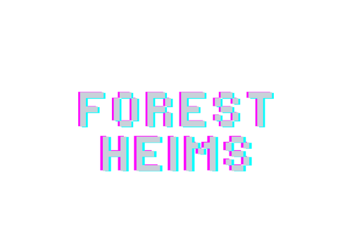

# 

I am a thoughtful software engineer confident and competent in planning, building and deploying full stack applications. I am most fluent and familiar with deploying projects built with the PERN stack (PostgreSQL, Express, React, Node), but am highly adaptable to other OOP tech stacks.

Particular interests of mine include bioinformatics, psychology, 3D engineering, audio engineering, audio visualization, game development, Linux, cybersecurity, computational chemistry/biology, genetic algorithms, drug discovery, organic chemistry, psychopharmacology, psychonautics, and open source software and education.
